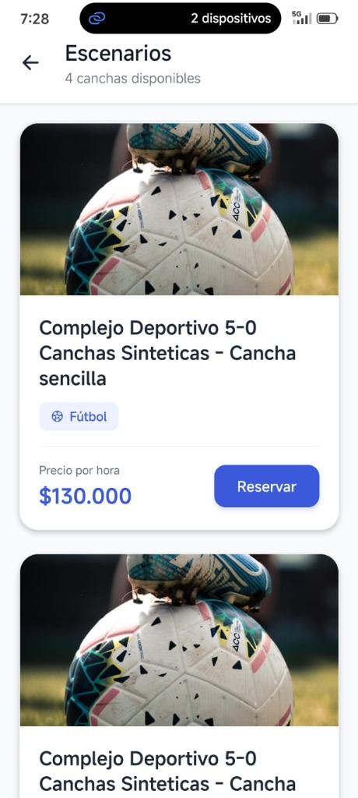
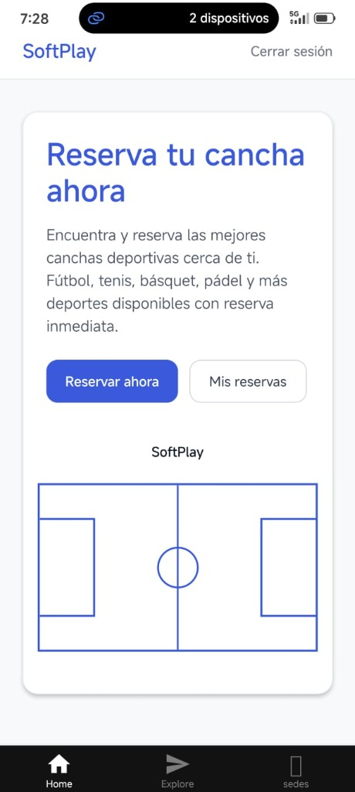
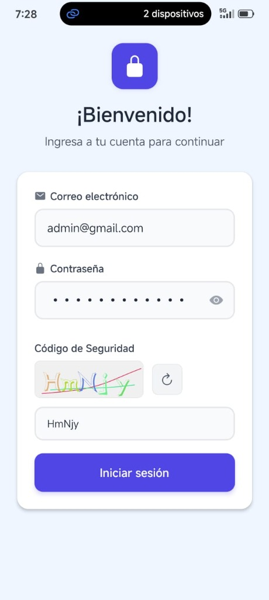
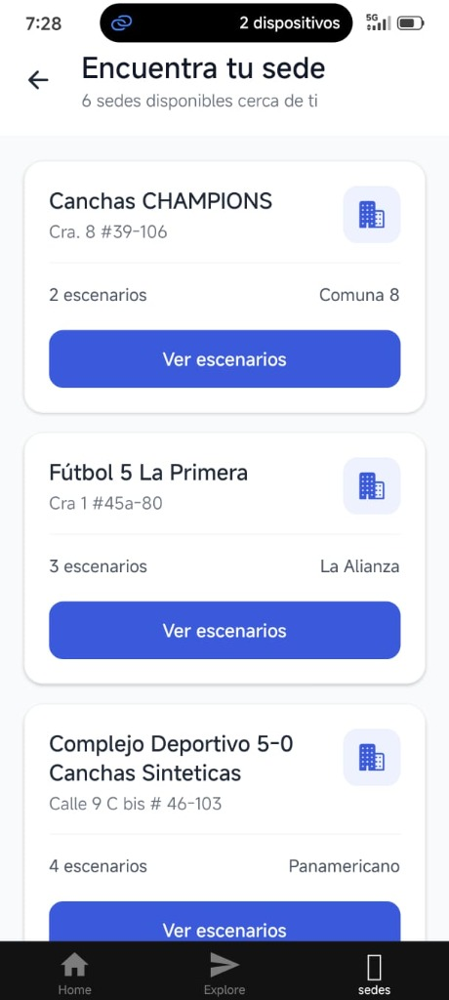

<div align="center">


# SoftPlay Mobile ⚽🏀🎾

**Tu plataforma deportiva en la palma de tu mano**

[](https://reactnative.dev/)
[](https://expo.dev/)
[](https://redux-toolkit.js.org/)
[](https://www.typescriptlang.org/)

</div>

---

## 📖 Descripción

**SoftPlay Mobile** es la aplicación móvil oficial del ecosistema SoftPlay, construida con **React Native + Expo Router**. Permite a los usuarios descubrir sedes deportivas, explorar sus escenarios y **reservar canchas en tiempo real** directamente desde su teléfono, con sincronización completa contra el backend en la nube.

La app está integrada con el backend desplegado en **Vercel** y ofrece experiencias fluidas nativas tanto en iOS como en Android.

---

## ✨ Funcionalidades Principales

| Módulo | Descripción |
|---|---|
| 🔐 **Autenticación** | Login y registro seguros con captcha anti-bot |
| 📍 **Explorar Sedes** | Listado de complejos deportivos con filtros y búsqueda |
| 🏟️ **Ver Escenarios** | Detalle por sede con imágenes, precio/hora y tipo de cancha |
| 📆 **Reservar Cancha** | Flujo multipaso con bloqueo temporal en tiempo real |
| 📋 **Mis Reservas** | Historial completo con estados y opción de cancelación |

### 🎯 Flujo de Reserva (Multipaso)

```
1. Detalles       →    2. Revisión       →    3. ¡Confirmado!
   Selecciona           Verifica toda          Reserva creada
   duración, fecha      la información         con estado Pendiente
   y hora exacta        antes de confirmar     de pago en cancha
```

- ⏱️ **Bloqueo temporal** al elegir una hora (evita conflictos con otros usuarios)
- 🔓 **Liberación automática** si el usuario cancela o abandona la pantalla
- 📊 Horarios **calculados dinámicamente** según configuración real de la sede (apertura, cierre, descansos, intervalos)

---

## 📱 Capturas de Pantalla

<div align="center">
  
  
  
  
</div>

---

## 🛠️ Stack Tecnológico

### Frontend / Mobile
| Tecnología | Uso |
|---|---|
| **React Native** `0.76` | Framework base de la app |
| **Expo SDK** `52` + **Expo Router** | Navegación file-based, build y deploy |
| **TypeScript** | Tipado estático en toda la app |
| **Redux Toolkit** | Estado global (auth, sedes, reservas) |
| **Axios** | Cliente HTTP hacia el backend |
| **Expo Vector Icons (Ionicons)** | Íconos nativos |
| **React Native Safe Area Context** | Insets seguros iOS/Android |

### Backend (Repositorio separado)
| Tecnología | Uso |
|---|---|
| **Node.js + Express** | API REST serverless |
| **MongoDB + Mongoose** | Base de datos de sedes, reservas y usuarios |
| **Vercel** | Plataforma de despliegue |
| **JWT** | Autenticación y sesiones |
| **AWS S3** | Almacenamiento de imágenes |

---

## 🗂️ Estructura del Proyecto

```
softplayMovile/
│
├── app/                          # Rutas de la app (Expo Router)
│   ├── (auth)/                   # Pantallas de autenticación
│   │   ├── login.tsx             # Inicio de sesión con captcha
│   │   └── register.tsx          # Registro de usuario
│   ├── (tabs)/                   # Pantallas principales (barra inferior)
│   │   ├── _layout.tsx           # Layout de tabs con barra de navegación
│   │   ├── index.tsx             # Pantalla de Inicio
│   │   ├── sedes.tsx             # Explorar sedes deportivas
│   │   └── reservas.tsx          # Mis Reservas (historial y gestión)
│   ├── escenarios/
│   │   └── [sedeId].tsx          # Escenarios de una sede específica
│   └── reservas/
│       └── [escenarioId].tsx     # Nueva reserva (flujo multipaso)
│
├── components/                   # Componentes reutilizables
│   └── ui/
│       └── Captcha.tsx           # Componente de captcha animado
│
├── store/                        # Estado Global (Redux)
│   ├── index.js                  # Configuración del store
│   └── slices/
│       ├── authSlice.js          # Autenticación y sesión de usuario
│       ├── canchasSlice.js       # Sedes y escenarios
│       └── reservasSlice.js      # Reservas (mis reservas, cancelar)
│
├── utils/
│   └── api.js                    # Instancia Axios con base URL y token JWT
│
└── constants/
    └── theme.ts                  # Colores y tipografía del diseño
```

---

## 🚀 Instalación y Configuración

### Prerrequisitos
- [Node.js](https://nodejs.org/) v18 o superior
- [Expo CLI](https://docs.expo.dev/get-started/installation/)
- App **Expo Go** en tu dispositivo iOS o Android

### 1. Clonar el repositorio

```bash
git clone https://github.com/CesarMoraCorrea/softplayMovile.git
cd softplayMovile
```

### 2. Instalar dependencias

```bash
npm install
```

### 3. Iniciar el servidor de desarrollo

```bash
npx expo start
```

Una vez iniciado el servidor:

| Tecla | Acción |
|---|---|
| `a` | Abrir en emulador **Android** |
| `i` | Abrir en simulador **iOS** *(solo macOS)* |
| `w` | Abrir en **navegador web** |
| Escanear QR | Abrir en **Expo Go** (dispositivo físico) |

---

## 🌐 API y Backend

La app se conecta al backend desplegado en Vercel. La URL base se configura en `utils/api.js`:

```js
// utils/api.js
const API_URL = "https://softplay-backend-git-develop-cesarmoracorreas-projects.vercel.app";
```

### Endpoints principales utilizados

```
POST   /auth/login                  → Inicio de sesión
POST   /auth/register               → Registro
GET    /auth/me                     → Verificar sesión
GET    /captcha/generate            → Generar captcha
POST   /captcha/check               → Validar captcha

GET    /sedes                       → Listar sedes
GET    /sedes/:id                   → Detalle de una sede
GET    /sedes/:sedeId/escenarios    → Escenarios de una sede

GET    /reservas/mias               → Mis reservas
GET    /reservas/ocupados/:id       → Horarios ocupados por fecha
POST   /reservas/bloquear           → Bloquear hora temporalmente
PATCH  /reservas/:id/estado         → Confirmar reserva
DELETE /reservas/:id                → Cancelar/liberar reserva
```

> 🔑 Todas las rutas protegidas envían el token JWT en el header `Authorization: Bearer <token>`

---

## 🔄 Estado Global (Redux)

```
store/
├── auth        → token, user, loading, error
├── canchas     → lista de sedes y escenarios
└── reservas    → list (mis reservas), loading, error
```

---

## 🧩 Características Técnicas Destacadas

### ⚡ Bloqueo Temporal de Reservas
Al seleccionar una hora, se crea automáticamente un "carrito" temporal en el backend:
- Si el usuario confirma → se convierte en reserva `pendiente`
- Si el usuario abandona → se libera automáticamente con `useFocusEffect`

### 🕐 Horarios Dinámicos
Los slots de hora se generan a partir de `configuracionHorarioSede` del backend considerando:
- Hora de apertura y cierre por día de la semana
- Intervalos de 30 o 60 minutos
- Descansos intermedios configurados
- Duración seleccionada por el usuario

### 🎨 Diseño "Boleto" en Mis Reservas
Las tarjetas de reservas usan una estética de tiquete con:
- Barra superior de color según el estado
- Separador punteado estilo boleto físico
- Badges con colores semánticos por estado

---

## 📦 Scripts Disponibles

```bash
npx expo start          # Iniciar servidor de desarrollo
npx expo start --clear  # Iniciar limpiando caché
npx expo build:android  # Build de producción Android (EAS)
npx expo build:ios      # Build de producción iOS (EAS)
```

---

## 🤝 Contribución

1. Haz fork del repositorio
2. Crea tu rama: `git checkout -b feature/mi-nueva-funcionalidad`
3. Realiza tus cambios y haz commit: `git commit -m 'feat: descripción clara del cambio'`
4. Sube tu rama: `git push origin feature/mi-nueva-funcionalidad`
5. Abre un **Pull Request** hacia `develop`

### Convención de commits
```
feat:     Nueva funcionalidad
fix:      Corrección de bug
refactor: Refactorización sin cambio de comportamiento
style:    Cambios de estilos / UI
docs:     Cambios en documentación
```

---

## 👥 Equipo

<table>
  <tr>
    <td align="center">
      <b>César Mora Correa</b><br/>
      <i>Full Stack Developer</i><br/>
      <a href="https://github.com/CesarMoraCorrea">@CesarMoraCorrea</a>
    </td>
  </tr>
</table>

---

## 📄 Licencia

Este proyecto es de uso privado. Todos los derechos reservados © 2026 SoftPlay.

---

<div align="center">
  <sub>Hecho con ❤️ y mucho ☕ · SoftPlay Mobile v1.0.0</sub>
</div>
